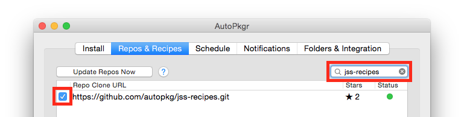
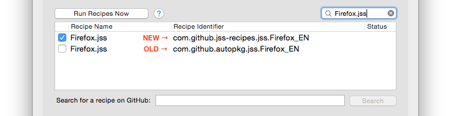
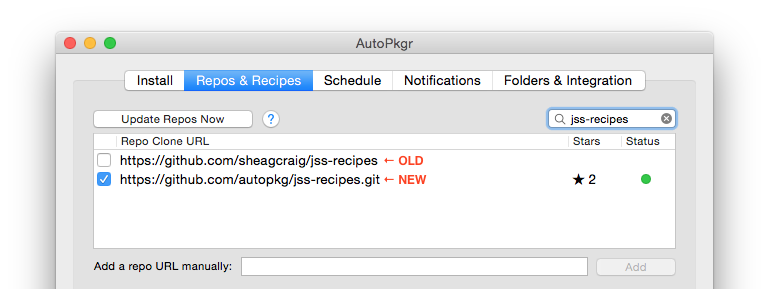

# Upgrading to the new JSS Recipes

The instructions are for the benefit of admins who subscribe to the old [sheagcraig/jss-recipes](https://github.com/sheagcraig/jss-recipes) repository and would like to smoothly transition to the new [autopkg/jss-recipes](https://github.com/autopkg/jss-recipes) repository.

:warning: The old sheagcraig/jss-recipes repository is now officially deprecated and will not receive any further updates. We recommend following these instructions soon.

1. __Subscribe to the new repository.__

	You can do this using autopkg:
	```
	autopkg repo-add https://github.com/autopkg/jss-recipes.git
	```

	Or in AutoPkgr, filter the repos list for "jss-recipes" and check the box to add the repo.
	

2. __Update your overrides.__

	If you have any overrides for recipes in sheagcraig/jss-recipes, we recommend deleting the old override and creating a new one for the corresponding recipe in autopkg/jss-recipes with the desired keys.

	_Old_ recipe overrides will typically have `ParentRecipe` keys that look like `com.github.sheagcraig.jss.___` or `com.github.autopkg.jss.___`.

	_New_ recipe overrides all have `ParentRecipe` keys that look like `com.github.jss-recipes.jss.___`.

	If you don't have any overrides for jss recipes, then you can skip this step.

3. If you use an automatic system to run autopkg, __unsubscribe from the old recipes and subscribe to the new ones__.

	In AutoPkgr, you'll need to uncheck all the old recipes, and check the new ones:
	

	If you use another automated system, you may need to change your saved recipe list manually.

4. __Remove the old repository.__

	You can do this using autopkg:
	```
	autopkg repo-delete https://github.com/sheagcraig/jss-recipes.git
	```

	Or in AutoPkgr, uncheck the `https://github.com/sheagcraig/jss-recipes` repo:

	

5. __Run the new recipes (or overrides) and test.__

	Perform a test run on one of the new recipes. For example: `autopkg run Firefox.jss -v`. Then check your JSS to make sure the policies, smart groups, packages, and extension attributes were updated as expected.

	If you have created any overrides, we strongly recommend running each of them and checking your JSS after each run.

That's it!

If you need help with this transition, please [submit an issue](https://github.com/autopkg/jss-recipes/issues/new) to this GitHub repo and we'll do our best to assist.
